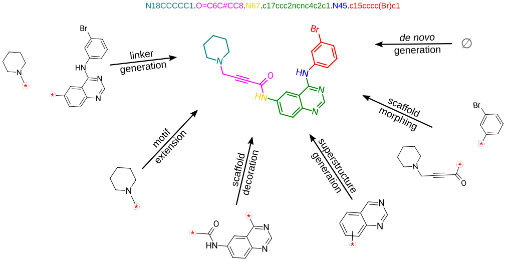
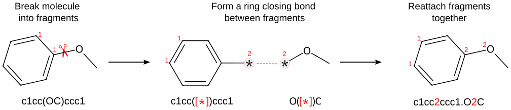

<h1 align="center">  🦺 SAFE </h1>
<h4 align="center"><b>S</b>equential <b>A</b>ttachment-based <b>F</b>ragment <b>E</b>mbedding (SAFE) is a novel molecular line notation that represents molecules as an unordered sequence of fragment blocks to improve molecule design using generative models.</h4>

</br>
<div align="center">
    
</div>
</br>

<p align="center">
    <a href="https://arxiv.org/pdf/2310.10773.pdf" target="_blank">
      Paper
  </a> |
  <a href="https://safe-docs.datamol.io/" target="_blank">
      Docs
  </a> |
  <a href="https://huggingface.co/datamol-io/safe-gpt" target="_blank">
    🤗 Model
  </a> |
  <a href="https://huggingface.co/datasets/datamol-io/safe-gpt" target="_blank">
    🤗 Training Dataset
  </a>
</p>

---

</br>

[](https://pypi.org/project/safe-mol/)
[](https://anaconda.org/conda-forge/safe-mol)
[](https://pypi.org/project/safe-mol/)
[](https://anaconda.org/conda-forge/safe-mol)
[](https://pypi.org/project/safe-mol/)
[](https://github.com/datamol-io/safe/blob/main/LICENSE)
[](https://github.com/datamol-io/safe/blob/main/DATA_LICENSE)
[](https://github.com/datamol-io/safe/stargazers)
[](https://github.com/datamol-io/safe/network/members)
[](https://arxiv.org/pdf/2310.10773.pdf)

[](https://github.com/datamol-io/safe/actions/workflows/test.yml)
[](https://github.com/datamol-io/safe/actions/workflows/release.yml)
[](https://github.com/datamol-io/safe/actions/workflows/code-check.yml)
[](https://github.com/datamol-io/safe/actions/workflows/doc.yml)

## Updates

The upcoming 1.0 release improves stereochemistry preservation, decoding and
sampling, moves SAFE-GPT to Transformers 5, and separates optional model and
training dependencies from the notation core. See the
[changelog](https://github.com/datamol-io/safe/blob/dev/CHANGELOG.md) and
[migration guide](migration.md) for fixes, deprecations and compatibility limits.
This work is on `dev` and is not yet a published release.

## Overview of SAFE

SAFE _is the_  deep learning molecular representation. It's an encoding leveraging a peculiarity in the decoding schemes of SMILES, to allow representation of molecules as a contiguous sequence of connected fragments. SAFE strings are valid SMILES strings, and thus are able to preserve the same amount of information. The intuitive representation of molecules as an ordered sequence of connected fragments greatly simplifies the following tasks often encountered in molecular design:

- _de novo_ design
- superstructure generation
- scaffold decoration
- motif extension
- linker generation
- scaffold morphing.

The construction of a SAFE strings requires defining a molecular fragmentation algorithm. By default, we use [BRICS], but any other fragmentation algorithm can be used. The image below illustrates the process of building a SAFE string. The resulting string is a valid SMILES that can be read by [datamol](https://github.com/datamol-io/datamol) or [RDKit](https://github.com/rdkit/rdkit).

</br>
<div align="center">
    
</div>


## News 🚀

#### 💥 2024/01/15 💥
1. [@IanAWatson](https://github.com/IanAWatson) has a C++ implementation of SAFE in [LillyMol](https://github.com/IanAWatson/LillyMol/tree/bazel_version_float) that is quite fast and use a custom fragmentation algorithm. Follow the installation instruction on the repo and checkout the docs of the CLI here: [docs/Molecule_Tools/SAFE.md](https://github.com/IanAWatson/LillyMol/blob/bazel_version_float/docs/Molecule_Tools/SAFE.md)

### Installation

SAFE 1.0 supports Python 3.11 through 3.14. Add it to a uv-managed project:

```bash
uv add safe-mol
```

Pip and conda-forge remain supported:

```bash
pip install safe-mol
mamba install -c conda-forge safe-mol
```

SAFE's core install contains only encoding, decoding and notation splitting.
Use `safe-mol[model]` for `SAFETokenizer` and `SAFEDesign`,
`safe-mol[train]` for the model stack plus `safe-train`, or
`safe-mol[all]` for every maintained feature. Model APIs remain available from
the top-level module and load their dependencies only when used.

The optional model stack uses Transformers 5. SAFE maintains random, greedy,
beam and beam-sampling paths. The constrained beam backend required by
model-only linker generation is loaded lazily from a reviewed, commit-pinned
Hugging Face repository. RDKit 2026.03 is excluded because of an upstream
stereochemistry regression; RDKit 2024.09 through 2025.09 are covered by CI.
Read [Migrating to SAFE 1.0](migration.md) before upgrading an existing
environment. Visualization and Weights & Biases remain independently available
through `safe-mol[viz]` and `safe-mol[wandb]`.

For constrained design, `try_hard=True` is the opt-in quality mode. It
oversamples, validates the molecular and substructure constraints, and removes
duplicates while preserving generation order. Use `max_new_tokens` to set a
prompt-independent generation budget:

```python
designer.scaffold_decoration(
    scaffold,
    n_samples_per_trial=20,
    max_new_tokens=80,
    try_hard=True,
)
```

### Datasets and Models

| Type                   | Name                                                                           | Infos      | Size  | Comment              |
| ---------------------- | ------------------------------------------------------------------------------ | ---------- | ----- | -------------------- |
| Model                  | [datamol-io/safe-gpt](https://huggingface.co/datamol-io/safe-gpt)              | 87M params | 350M  | Default model        |
| Training Dataset       | [datamol-io/safe-gpt](https://huggingface.co/datasets/datamol-io/safe-gpt)     | 1.1B rows  | 250GB | Training dataset     |
| Drug Benchmark Dataset | [datamol-io/safe-drugs](https://huggingface.co/datasets/datamol-io/safe-drugs) | 26 rows    | 20 kB | Benchmarking dataset |

## Usage


The tutorials in the [documentation](https://safe-docs.datamol.io/) can help you get started with `safe` and `SAFE-GPT`.

### API

We summarize some key functions provided by the `safe` package below.

| Function      | Description                                                                                                                                                                                             |
| ------------- | ------------------------------------------------------------------------------------------------------------------------------------------------------------------------------------------------------- |
| `safe.encode` | Translates a SMILES string into its corresponding SAFE string.                                                                                                                                          |
| `safe.decode` | Translates a SAFE string into its corresponding SMILES string. The SAFE decoder just augment RDKit's `Chem.MolFromSmiles` with an optional correction argument to take care of missing hydrogens bonds. |
| `safe.split`  | Tokenizes a SAFE string to build a generative model.                                                                                                                                                    |

### Examples

#### Translation between SAFE and SMILES representations

```python
import safe

ibuprofen = "CC(Cc1ccc(cc1)C(C(=O)O)C)C"

# SMILES -> SAFE -> SMILES translation
try:
    ibuprofen_sf = safe.encode(ibuprofen)  # c12ccc3cc1.C3(C)C(=O)O.CC(C)C2
    ibuprofen_smi = safe.decode(ibuprofen_sf, canonical=True)  # CC(C)Cc1ccc(C(C)C(=O)O)cc1
except safe.SAFEEncodeError:
    pass
except safe.SAFEDecodeError:
    pass

ibuprofen_tokens = list(safe.split(ibuprofen_sf))
```

### Training/Finetuning a (new) model

A command line interface is available to train a new model, please run `safe-train --help`. You can also provide an existing checkpoint to continue training or finetune on you own dataset.

For example:

```bash
safe-train --config <path to config> \
    --model-path <path to model> \
    --tokenizer  <path to tokenizer> \
    --dataset <path to dataset> \
    --num_labels 9 \
    --torch_compile True \
    --optim "adamw_torch" \
    --learning_rate 1e-5 \
    --prop_loss_coeff 1e-3 \
    --gradient_accumulation_steps 1 \
    --output_dir "<path to outputdir>" \
    --max_steps 5
```


## References

If you use this repository, please cite the following related [paper](https://arxiv.org/abs/2310.10773#):

```bib
@misc{noutahi2023gotta,
      title={Gotta be SAFE: A New Framework for Molecular Design},
      author={Emmanuel Noutahi and Cristian Gabellini and Michael Craig and Jonathan S. C Lim and Prudencio Tossou},
      year={2023},
      eprint={2310.10773},
      archivePrefix={arXiv},
      primaryClass={cs.LG}
}
```

## License

The training dataset is licensed under CC BY 4.0, which permits reuse with attribution, including commercial reuse. See [DATA_LICENSE](data_license.md) for details. SAFE-GPT model weights are separately licensed under CC BY-NC 4.0 for non-commercial use.

This code base is licensed under the Apache-2.0 license. See [LICENSE](license.md) for details.

## Development lifecycle

### Setup dev environment

```bash
uv sync --all-extras
```

This creates an isolated `.venv` with the training, visualisation, reporting,
test, documentation and development extras. `env.yml` remains available when a
Conda environment is required.

### Tests

You can run tests locally with:

```bash
uv run python -m pytest -m "not integration"
uv run python -m pytest -m integration --no-cov
```

The integration command validates the published SAFE-GPT model and executes
the maintained tutorials. GitHub Actions runs the same command. Use
`uv run python -m pytest -m notebook --no-cov` when iterating on tutorials only.
